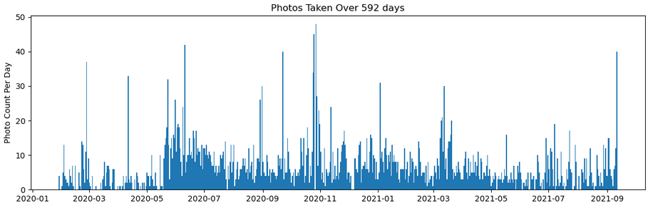
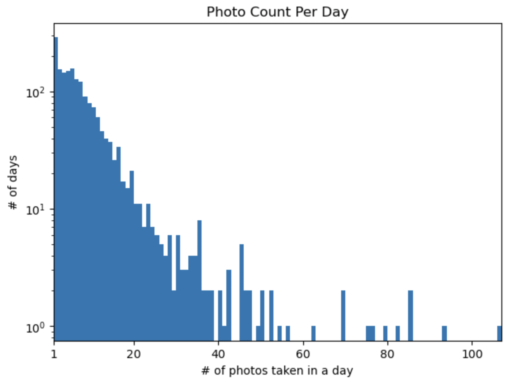
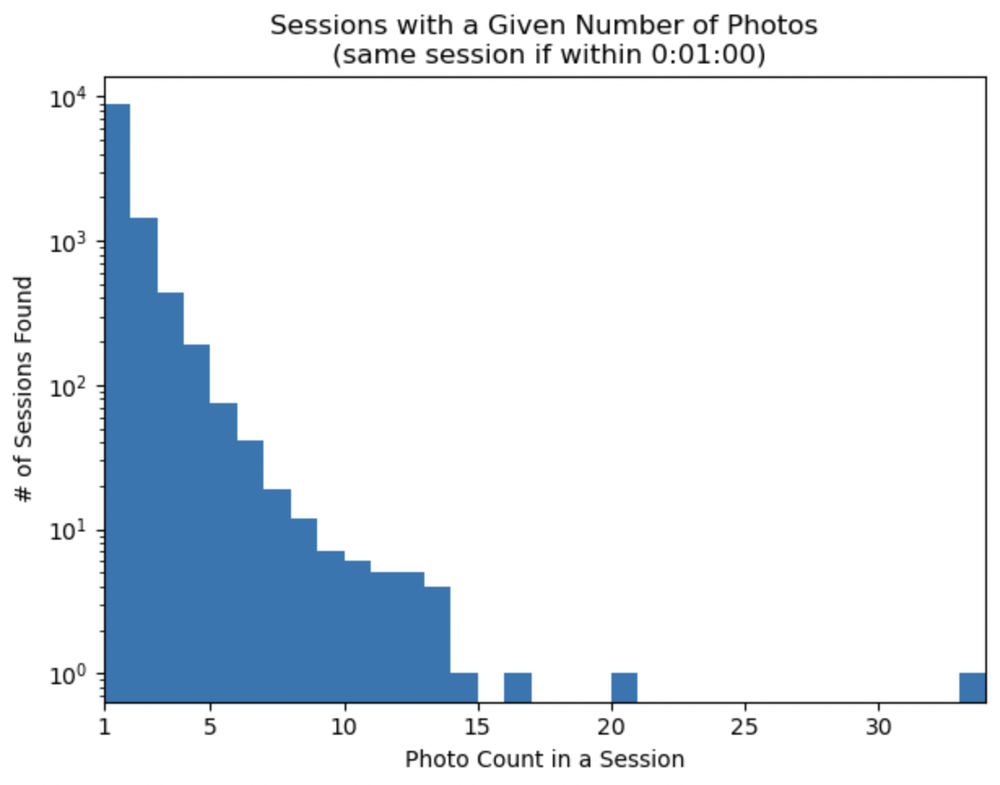

# Let's Analyze Our Smartphone Camera Usage Habits

I'm exploring a theory that photo-taking on smartphones happens in "sessions" where, once you've taken your phone out of your pocket/purse/backpack, you're often taking multiple photos in a row.

This is a set of scripts to run on your computer to the timing of photos in your entire photo library. I'm grateful for your help!

<table width="100%">
  <tr></tr>
  <tr>
    <td></td>
    <td></td>
  </tr>
</table>

## Identify Your Photo Library Location

In Mac Photos app: `~/Pictures/Photos Library.photoslibrary/originals/`

On my Windows PC, in Dropbox `~/Dropbox/Camera Uploads/`

The scripts we'll run below will be able to see photos even if they're in subfolders.

First, use a shell open to this folder location, i.e.

```
$ cd <your photo library's directory>
```

## Get The List of Photo Files

On Mac:
```
$ find . -name "*.jpg" -o -name "*.jpeg" -o -name "*.heic" >> ~/my-photo-library-list.txt
```
On Windows, in Powershell:
```
$ Get-ChildItem -Path . -Recurse -Include *.jpg,*.jpeg,*.heic | ForEach-Object { $_.FullName } > ~/my-photo-library-list.txt
```

NOTE: .png isn't included here on purpose, as those are typically screenshots.

Check how many photos the script found:

On Mac:
```
$ cat ~/my-photo-library-list.txt | wc -l
   23124
```
On Windows:
```
$ (Get-Content ~/my-photo-library-list.txt).Count
```

For example, I have 23k photos in my Mac library, from 2020-2024

## Read The Photo Creation Dates

You will need `exiftool` to read photo metadata.
On Mac, install with `brew install exiftool`
On Windows, install with `choco install exiftool`

The following takes a while to run. I found it takes about 1 minute per 1k photos in your library.

On Mac:
```
$ cat ~/my-photo-library-list.txt | xargs -I{} exiftool -time:all -G1 -a -s {} | grep SubSecCreateDate >> ~/my-photos-creationdate.txt
```
On Windows:
```
$ Get-Content ~/my-photo-library-list.txt | ForEach-Object { exiftool -time:all -G1 -a -s $_ } | Select-String "DateTimeOriginal" | Out-File -Append ~/my-photos-creationdate.txt
```

NOTE: for some reason, Mac Photos contain EXIF `SubSecCreateDate`, but photos in Dropbox don't. We rely on `DateTimeOriginal` there, but it would be really nice if we had sub-second creation time everywhere.

# Share With Me!

Send the output `~/my-photos-creationdate.txt`, to me. Email works: dustin.freeman@gmail.com

To clean up, you can delete the two files we generated: `~/my-photo-library-list.txt` and `~/my-photos-creationdate.txt`

## Privacy Considerations

The output you share with me will have the timestamp and time zone of every file you've taken. It's fair if you feel uncomfortable sharing this private info. Read on...

Data Usage: All I'm doing with your timestamps is generating the plots "Photo Count Per Day" and "Sessions with a Given Number of Photos". I will save these images for comparison, and I will then delete the list of timestamps you sent. The plots generated will not be associated with your name anywhere (other than in my head, if I remember personally).

I use this [Jupyter Notebook](./photo-session-finder.ipynb) to generate the plots. You can run this yourself and send me your plots if you'd prefer.
